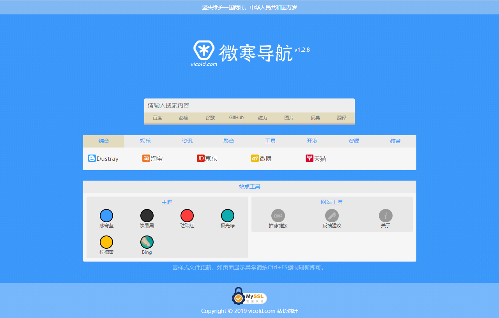

# Vicold 微寒导航

> 没有花里胡哨的新闻，没有杂七杂八的广告，我所有的功能，最基本、且强大。

网站基于静态HTML5开发，目的是代替某些杂七杂八的网址导航，主打简洁轻快。网站同时适配桌面端、移动端，兼容性更强。
本网站为本人自用，请勿收藏。（斜眼笑.png）



## 访问

https://vicold.com

## 开始开发

```git clone https://e.coding.net/vicold/vicold.coding.me.git```

## 发布历史

### Version 1.2.8 [2019.11.20]
新增Bing每日图片主题
修复Safari浏览器搜索按钮圆角问题
更改部分样式
更改网站托管商，原托管爆炸


### Version 1.2.7 [2019.11.19]
添加反馈入口
继续精简样式代码，加快主题切换速度和流畅度（因样式文件更新，如页面显示异常请按Ctrl+F5强制刷新即可）
修复一个错误
其他无关紧要的修改


### Version 1.2.6 [2019.11.15]
优化部分样式
精简样式代码，加快主题切换速度和流畅度


### Version 1.2.5 [2019.09.14]
增加footer栏
优化样式代码


### Version 1.2.4 [2019.09.13]
增加黄色主题
优化样式代码
修复搜索关键字中带有某些字符时导致无法搜索的问题


### Version 1.2.3 [2019.09.08]
优化css显示


### Version 1.2.2 [2019.08.30]
更新其他快捷键功能：
    Enter（未聚焦）：聚焦
    Alt + ?：聚焦并清空搜索框


### Version 1.2.1 [2019.08.22]
增加必应词典搜索
增加搜索快捷键功能：
    Enter：百度搜索
    Alt + Z：必应搜索
    Alt + X：谷歌搜索
    Alt + C：GitHub搜索    
    Alt + V：磁力搜索
    Alt + B：百度图片搜索
    Alt + N：必应词典
    Alt + M：百度翻译


### Version 1.2 [2019.08.09]
增加“关于”页
修复不能搜索带“#”字符的问题


### Version 1.1 [2019.05.12]
开发多主题模式


### Version 1.0 [2019.03.04]
构建完整项目框架并进行开发
            
